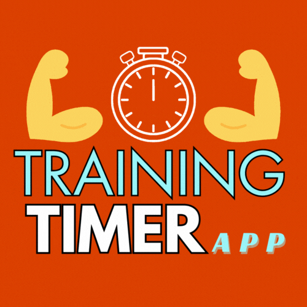

# Welcome to README
## of `Training Timer APP` project !
 

 ### Table of Contents
1. [About me](#at-first-a-few-words-about-me)
2. [Project introduction](#introducing-the-training-timer-app)
3. [Built With](#project-built-with)
4. [Database](#database)
5. [Screenshots](#shots)
6. [How to run](#how-to-run)
8. [Acknowledgments](#acknowledgments)
9. [Contact](#contact)

## At first a few words `about me`
This is my first such a big (but maybe not so big as you just imagine at this moment) project ever, where idea, implementation and execution are 100% mine. Including [backend of this project](https://github.com/KrisKrzysztof/TreningTimerApp-backend), and it works only with this backend and his database. By the way, both readme.md files (for front- and backend) are very similar, so it is enough if you read one of them. \
Please note that user interface is prepared in Polish language, but in future I plan to make it also in English.

About a year ago I have started learning of programming with [MegaK.pl](https://www.megak.pl/), this was my first serious adventure with programming even though I have been somewhat interested in topics related to computer science all my life, so... please appreciate this project ;)

(<a href="#welcome-to-readme">back to top</a>)

## Introducing the `Training Timer App`
In Short: Training Timer App is an application used to measure the pause time in training between specific exercises.

The application allows you to edit and add new trainings where you can insert own training name, description, number of exercises series, names of exercises and pause time after every exercise. 

There are **three main parts** of the application: 
* ***Main page*** - Introducing shortly the application, and shows a list of trainings (stored in database and available in the whole app).
* ***Training page*** - This is the main functionality of the app. Here the user can choose a training from list of available training and just start training. After choosing any training, there will show interface of the training. At the beginning of course you have to do first exercise, and then the user approves that exercises is done. Then will show the timer where starts countdown to the end of pause. When the pause is finished, training continues with the next exercise. Below you can find a preview of the training and his description. 
* ***Edit Page*** - On this part of the website, the user sees the list of available trainings with buttons "Edit" and "Delete". As it is simple to predict, these buttons allow deleting the training or editing. After pressing the "Edit" button, the user is redirected to a form where it is possible to change every detail of the training. Of course, it is also possible to add a completely new training (user is redirected to also to a suitable, empty form).

(<a href="#welcome-to-readme">back to top</a>)

## Project built with
#### Technology used in this project (both frontend and [backend](https://github.com/KrisKrzysztof/TreningTimerApp-backend)):

* [Node.js](https://nodejs.org)
* [Typescript](https://www.typescriptlang.org)
* [React.js](https://react.dev)
  * [React DOM](https://www.npmjs.com/package/react-dom)
  * [React Router DOM](https://github.com/remix-run/react-router#readme)
  * [React scripts](https://github.com/facebook/create-react-app#readme)
  * [customize-cra and react-app-rewired](https://www.npmjs.com/package/customize-cra)
* [UUID](https://www.npmjs.com/package/uuid)
* [Express.js](https://expressjs.com/)
  * [express-async-errors](https://github.com/davidbanham/express-async-errors#readme)
  * [express-rate-limit](https://www.npmjs.com/package/express-rate-limit)
* [mysql2](https://github.com/sidorares/node-mysql2#readme)
* [cors](https://github.com/expressjs/cors#readme)
* [TS-node](https://typestrong.org/ts-node)

(<a href="#welcome-to-readme">back to top</a>)

## Database
As mentioned before, there is a database required for this application to run.\
Here is the table what shows the structure of the database in SQL:

| #  | Column         |     Type     | Null allowed | Default  value |
|----|:---------------|:------------:|:------------:|:--------------:|
| 1  | id (primary)   | varchar(36)  |      no      |     uuid()     |
| 2  | name           | varchar(25)  |      no      |                |
| 3  | description    |   tinytext   |     yes      |      null      |
| 4  | numberOfSeries |    int(2)    |      no      |                |
| 5  | exerciseOne    | varchar(30)  |      no      |                |
| 6  | pauseOne       |    int(3)    |      no      |                |
| 7  | exerciseTwo    | varchar(30)  |     yes      |      null      |
| 8  | pauseTwo       |    int(3)    |     yes      |      null      |
| 9  | exerciseThree  | varchar(30)  |     yes      |      null      |
| 10 | pauseThree     |    int(3)    |     yes      |      null      |
| 11 | exerciseFour   | varchar(30)  |     yes      |      null      |
| 12 | pauseFour      |    int(3)    |     yes      |      null      |
| 13 | exerciseFive   | varchar(30)  |     yes      |      null      |
| 14 | pauseFive      |    int(3)    |     yes      |      null      |
| 15 | exerciseSix    | varchar(30)  |     yes      |      null      |
| 16 | pauseSix       |    int(3)    |     yes      |      null      |
| 17 | exerciseSeven  | varchar(30)  |     yes      |      null      |
| 18 | pauseSeven     |    int(3)    |     yes      |      null      |
| 19 | exerciseEight  | varchar(30)  |     yes      |      null      |
| 20 | pauseEight     |    int(3)    |     yes      |      null      |
| 21 | exerciseNine   | varchar(30)  |     yes      |      null      |
| 22 | pauseNine      |    int(3)    |     yes      |      null      |
| 23 | exerciseTen    | varchar(30)  |     yes      |      null      |
| 24 | pauseTen       |    int(3)    |     yes      |      null      |

I know that this table is a little monster, and it makes next monsters in further code, but I am beginner and I did this project after working hours, so I could not find time to make it in a better way.\
Of course, I prepared more simple method to create compatible database and even  table with data for this project, you can just run SQL from [this file](./repo_utils/database/trainings.sql) in your SQL client.

(<a href="#welcome-to-readme">back to top</a>)
 

## Shots

### Main page

(<a href="#how-to-run">next chapter</a> or <a href="#welcome-to-readme">back to top</a>)
 

### Training choosing

(<a href="#how-to-run">next chapter</a> or <a href="#welcome-to-readme">back to top</a>)

### Training timer

(<a href="#how-to-run">next chapter</a> or <a href="#welcome-to-readme">back to top</a>)

### Training task

(<a href="#how-to-run">next chapter</a> or <a href="#welcome-to-readme">back to top</a>)

### Edit page

(<a href="#how-to-run">next chapter</a> or <a href="#welcome-to-readme">back to top</a>)

### Adding new training

(<a href="#how-to-run">next chapter</a> or <a href="#welcome-to-readme">back to top</a>)

### Modifying training

(<a href="#welcome-to-readme">back to top</a>)
 

## How to run
The Training Timer App was released on [Network Manager server](https://netcloud24.com/pl/index) on this address: https://trainingtimer.networkmanager.pl/ 
### However, you can just use git to clone this repository with this command:
### `git clone https://github.com/KrisKrzysztof/TreningTimerApp-frontend.git`
#### then you can run this app locally (of course Node.js environment is required) with following scripts:
### `npm start`
Just like basic React instruction say:\
it runs the app in the development mode.\
When you open http://localhost:3000 in the browser,\
the page will reload if you make edits.\
You will also see any lint errors in the console.
### `npm run build`
Builds the app for production to the `build` folder.\
It correctly bundles React in production mode and optimizes the build for the best performance.\
And this version you can release on any server.
See the section about [deployment](https://facebook.github.io/create-react-app/docs/deployment) for more information.

(<a href="#welcome-to-readme">back to top</a>)

## Acknowledgments
#### Special thanks for MegaK team:
### Bartłomiej Borowczyk, Jakub Król and Marcin Grygierek
who had a major impact on my introduction and development in the world of programming.

And a humble thanks for me that for being able to finish this project.\
This work learned me a lot and I hope that this knowledge will be useful and will bring me more fun than programing stress. ;)

## Contact
You can contact author of this project sending message via [linkedin](https://www.linkedin.com/in/007kris).

(<a href="#welcome-to-readme">back to top</a>)

